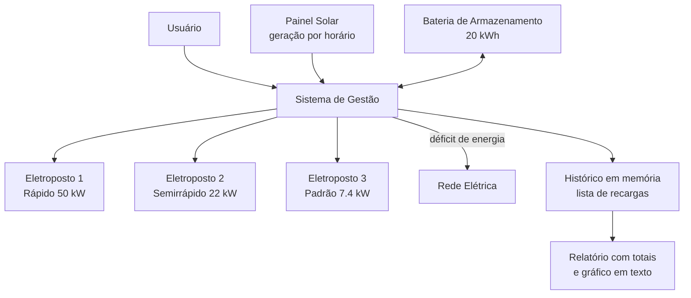
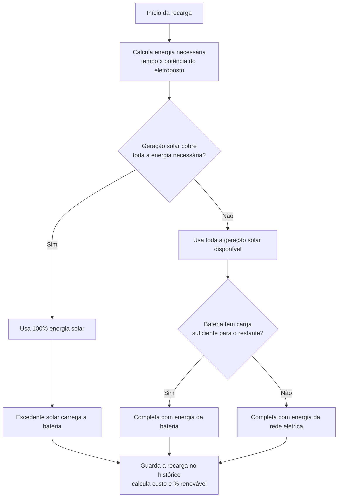

# sprint2_grupo2

# Gestão Sustentável de Eletropostos

**Equipe:** _[nome dos integrantes do grupo]_

---

## Índice
- [Sprint 2 — Prova de Conceito Funcional](#sprint-2--prova-de-conceito-funcional)
- [Sprint 3 — Prototipagem Funcional e Integração](#sprint-3--prototipagem-funcional-e-integração)

---

# Sprint 2 — Prova de Conceito Funcional

## Arquitetura do Sistema

O sistema foi desenvolvido em Python com o objetivo de simular o funcionamento básico de um eletroposto sustentável.

O usuário informa os dados da recarga, como tempo de carregamento e potência do carregador. O sistema processa essas informações e calcula automaticamente o consumo de energia e o custo estimado da recarga.

Após o processamento, os resultados são exibidos na tela junto com a identificação da fonte de energia utilizada.

## Diagrama do Sistema

Usuário
   ↓
Entrada de dados da recarga
   ↓
Sistema em Python
   ↓
Cálculo de consumo e custo
   ↓
Exibição dos resultados

## Justificativas Técnicas

O Python foi escolhido por ser uma linguagem simples, eficiente e adequada para protótipos funcionais e simulações.

A utilização de cálculos automáticos permite demonstrar o monitoramento do consumo energético em eletropostos de forma prática e objetiva.

A simulação da utilização de energia solar foi adicionada para representar a integração com fontes de energia renovável e demonstrar a aplicação de conceitos sustentáveis no sistema.

## Instruções de Uso
1. Abrir o arquivo Python no VS Code ou outra IDE.
2. Executar o programa (`python sers_sprint2.py`).
3. Escolher a opção "Simular recarga".
4. Informar:
   - tempo de carregamento;
   - potência do carregador;
   - utilização de energia solar.
5. Visualizar os resultados gerados pelo sistema.

## Sustentabilidade e Energias Renováveis

O projeto utiliza conceitos de sustentabilidade e eficiência energética para incentivar um uso mais consciente da energia nos eletropostos.

A solução busca reduzir desperdícios energéticos por meio do monitoramento do consumo durante as recargas e incentivar o uso de fontes renováveis, como a energia solar.

Além disso, o sistema contribui para a conscientização sobre mobilidade sustentável e consumo eficiente de energia.

---

# Sprint 3 — Prototipagem Funcional e Integração

## Título do Projeto
**Gestão Sustentável de Eletropostos** — sistema simulado de gerenciamento inteligente de recarga de veículos elétricos com integração de energia solar e armazenamento em bateria.

## Equipe Envolvida
569308 Leticia Araujo Espindola

570692 FELIPE MITSUO

569181 Laura Godoy Callegari

569207 Mariana Dreset Carbollan

570599 Milena de Aguiar Lopes Cardoso

570990 Felipe Perdigão Macedo

## Visão Geral da Evolução (Sprint 2 → Sprint 3)
Na Sprint 2, o sistema simulava **uma única recarga isolada**, com o usuário informando manualmente se a energia era solar ou não. Na Sprint 3, o sistema passa a **integrar de fato** os componentes da solução, com um algoritmo de automação decidindo sozinho qual fonte de energia usar:

| Sprint 2 | Sprint 3 |
|---|---|
| 1 eletroposto genérico | 3 eletropostos com potências reais (rápido, semirrápido, padrão) |
| Usuário informa se é solar (s/n) | Painel solar simulado com curva de geração por horário |
| Sem armazenamento | Bateria que absorve excedente solar e supre déficits |
| Sem lógica de decisão | Automação: prioridade Solar → Bateria → Rede |
| Sem histórico | Histórico das recargas guardado em uma lista durante a execução |
| Sem relatório | Relatório consolidado com totais e gráfico simples em texto |

## Esquema de Integração dos Componentes



### Fluxograma da Lógica de Automação (decisão de fonte de energia)



## Justificativa Técnica das Escolhas

- **Python (continuidade da Sprint 2):** mantido por ser simples e por permitir organizar o sistema em funções (`gerar_energia_solar`, `carregar_bateria`, `simular_recarga`, `gerar_relatorio`), cada uma responsável por um componente da solução, sem precisar de bibliotecas externas.
- **Curva senoidal para geração solar:** a geração de um painel fotovoltaico real segue aproximadamente uma curva de sino ao longo do dia (zero à noite, pico ao meio-dia). Uma função com `seno` simples é suficiente para representar esse comportamento de forma tecnicamente coerente, sem exigir dados meteorológicos reais.
- **Bateria como buffer (representada por um dicionário):** a bateria foi incluída porque, na prática, geração solar e demanda de recarga raramente coincidem perfeitamente. Ela representa o papel real de um sistema de armazenamento: guardar excedente solar e devolvê-lo quando a demanda supera a geração.
- **Prioridade Solar → Bateria → Rede:** essa ordem reflete a lógica de despacho usada em sistemas reais de energia distribuída — sempre priorizar a fonte renovável já gerada localmente antes de recorrer à rede elétrica, reduzindo custo e impacto ambiental.
- **Histórico em lista de dicionários:** cada recarga simulada é guardada como um dicionário numa lista em memória, permitindo calcular totais reais (soma de energia, custo, etc.) a partir das simulações feitas na própria execução, sem depender de números fixos.
- **Gráfico em texto (barras com `#`):** em vez de uma biblioteca externa, o relatório desenha barras proporcionais usando `print`, o que já é suficiente para visualizar a proporção entre solar, bateria e rede — o dado central de sustentabilidade do projeto.

## Resultados e Dados Funcionais

Abaixo, um exemplo real de execução do sistema, com três recargas simuladas em horários diferentes do dia (meio-dia, manhã e noite), mostrando a automação respondendo de forma diferente a cada cenário:

| Estação | Horário simulado | Energia (kWh) | Solar | Bateria | Rede | Custo (R$) | % Renovável |
|---|---|---|---|---|---|---|---|
| Ponto Padrão (7.4 kW) | 12h (pico solar) | 14,80 | 14,80 | 0,00 | 0,00 | 0,00 | 100% |
| Ponto Semirrápido (22 kW) | 8h (sol fraco) | 22,00 | 5,00 | 15,20 | 1,80 | 1,53 | 91,8% |
| Ponto Rápido (50 kW) | 20h (sem sol) | 25,00 | 0,00 | 0,00 | 25,00 | 21,25 | 0% |
| **Total** | | **61,80** | **19,80** | **15,20** | **26,80** | **22,78** | **56,6%** |

O próprio sistema gera um gráfico simples em texto a partir desses dados, exibido no terminal ao escolher a opção "Gerar relatório":

```
Distribuição de energia por fonte:
Solar    | ############ 19.8 kWh
Bateria  | ######### 15.2 kWh
Rede     | ################# 26.8 kWh
```

## Conexão com os Conteúdos da Disciplina

- **Energias renováveis:** simulação da geração solar fotovoltaica e sua variação ao longo do dia.
- **Armazenamento de energia:** papel da bateria como elemento que desacopla o momento da geração do momento do consumo.
- **Eficiência energética:** lógica de despacho que minimiza o uso da rede elétrica, reduzindo custo e desperdício.
- **Automação:** decisão automática de fonte de energia sem intervenção manual do usuário, ao contrário da Sprint 2.
- **Monitoramento e dados:** registro histórico de sessões e geração de relatório, refletindo práticas reais de gestão energética baseada em dados.

## Instruções de Uso

1. Executar o programa (não precisa instalar nenhuma biblioteca extra):
   ```
   python sers_sprint3.py
   ```
2. No menu, escolher:
   - **1** — Simular recarga (usa o horário atual do computador para calcular a geração solar);
   - **2** — Ver status do sistema (geração solar atual e nível da bateria);
   - **3** — Gerar relatório consolidado (soma todas as recargas feitas nessa execução e mostra o gráfico em texto);
   - **4** — Simular recarga em um horário personalizado (útil para demonstrar o sistema em diferentes momentos do dia durante o vídeo, sem precisar esperar o horário real mudar);
   - **5** — Sair.
3. O histórico das recargas fica guardado apenas na memória durante a execução: para o relatório mostrar dados, é preciso simular pelo menos uma recarga (opção 1 ou 4) antes de usar a opção 3. Ao fechar o programa, o histórico é perdido — se quiserem manter os dados entre execuções, isso pode ser adicionado numa próxima sprint.

## Sustentabilidade e Energias Renováveis (Sprint 3)

Enquanto a Sprint 2 apenas identificava se uma recarga *tinha sido* feita com energia solar, a Sprint 3 demonstra a **gestão ativa** dessa energia: o sistema decide automaticamente como combinar solar, bateria e rede para maximizar o uso de fontes renováveis em cada recarga, e apresenta dados agregados (% renovável médio, custo total evitado) que tornam mensurável o benefício ambiental e econômico da solução.
